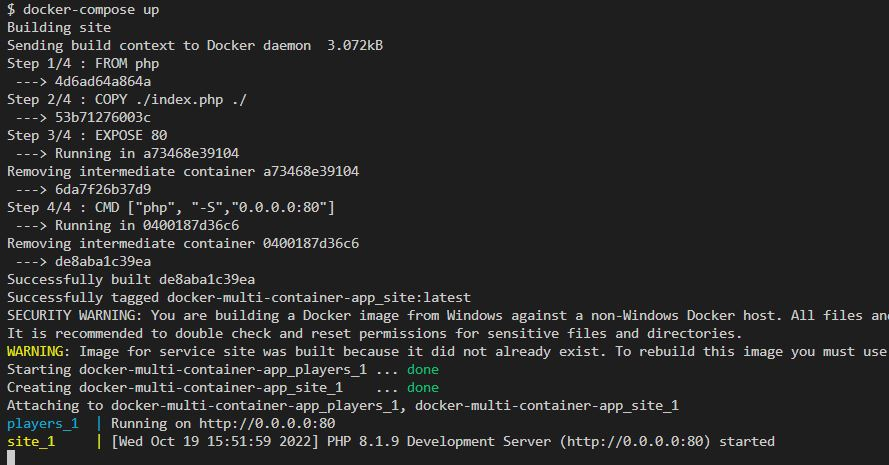

Our application will use a PHP frontend and a Node backend.
Most of the code will come through dev branch
First we create docker-compose.yml
```
touch docker-compose.yml
```

docker-compose.yml file
```
version: "3"

services: 
   players:
     build: ./players
     ports:
        - 5002:80

```


### Make dir for players which will contain the dockerfile. It will
also contain server.js and package.json files for the application

```
touch players/Dockerfile
```
```
touch players/package.json
```
```
touch players/server.js
```

Our server.js file 
```
const express = require('express');
const app = express();

const HOST = '0.0.0.0';

const PORT = 80;

app.get('/',(req,res)=>{

  res.json({
    players: ['Liz','Dele','Victor','Abi']

  })

});

app.listen(PORT,HOST);

console.log(`Running on http://${HOST}:${PORT}`);
```

The package.json file will contain the app dependencies

```
{
    "dependencies":{

        "express": "^4.16.1"

    }

}
```

Next, we create the Dockerfile for the player backend container
```
FROM node
WORKDIR /app
COPY ./package.json ./package.json
RUN npm install
COPY . .
EXPOSE 80
CMD ["node","server.js"]
```

```
docker-compose up

```


```
$ docker-compose up
Creating network "docker-multi-container-app_default" with the default driver
Building players
Sending build context to Docker daemon  4.096kB
Step 1/6 : FROM node
 ---> 3adbe565b1f0
Step 2/6 : WORKDIR /app
 ---> Using cache
 ---> 47ff2c90c0ae
Step 3/6 : COPY ./package.json ./package.json
 ---> d8764e8f8da9
Step 4/6 : RUN npm install
 ---> Running in 5603a4979928

added 57 packages, and audited 58 packages in 20s

7 packages are looking for funding
  run `npm fund` for details

found 0 vulnerabilities
npm notice 
npm notice New minor version of npm available! 8.15.0 -> 8.19.2        
npm notice Changelog: <https://github.com/npm/cli/releases/tag/v8.19.2>
npm notice Run `npm install -g npm@8.19.2` to update!
npm notice 
Removing intermediate container 5603a4979928
 ---> 8875a33c68da
Step 5/6 : COPY . .
 ---> 29268cfd6708
Step 6/6 : CMD ["node","server.js"]
 ---> Running in d415457d4e89
Removing intermediate container d415457d4e89
 ---> ef2136fe9a7e
Successfully built ef2136fe9a7e
Successfully tagged docker-multi-container-app_players:latest

```


### Now lets start building the PHP fronend
### Get the array of elements from the node backend and disply them with html
Let's create directory site for our php application
```
touch mkdir site
```

```
touch site/index.php
````
```
touch site/Dockerfile
````

### Index.php file

```
<html>
    <body>
        <h1>Team </h1>
        <ul>
        <?php
        $json = file_get_contents('http://players');
        $players = json_decode($json)->players;

        foreach ($players as  $player){

            echo"<li>$player</li>";
        }

        ?>

        </ul>

    </body>
</html>
```

### Next we update docker-compose.yml
```
version: "3"

services: 
   players:
     build: ./players
     ports: 
       - 5002:80

   site:
      build: ./site
      ports:
        - 5000:80
      depends_on:
        - players
```




### I will go to the browser at localhost:80


### Next we update the backend server.js players array with a new entry but it doesn't show in the frontend.
```
players: ['Liz','Dele','Victor','Abi','Jonathan','Bibi']

```
### We update index.php title too but it doesn't show in the frontend either.

```
<h1>Team Members</h1>
```

### I stopped both containers and started docker-compose again

- Still no changes


### We need to use the --build option so that the cached images are rebuilt for our changes to manifest.

```
docker-compose up --build
```


###  To enable dynamic updates without rebuilding, we will use volumes

### I will update the dockercompose file to expose a volume.  - ./site:/src

```
version: "3"

services: 
   players:
     build: ./players
     ports: 
       - 5002:80

   site:
      build: ./site
      ports:
        - 5000:80
      depends_on:
        - players
      volumes:
        - ./site:/src
      

```

### I will then update the /site dockerfile to reflect src as the working directory

```
FROM php
WORKDIR /src
COPY ./index.php ./
EXPOSE 80
CMD ["php", "-S","0.0.0.0:80"]
```

### END OF MULTI CONTAINER APP